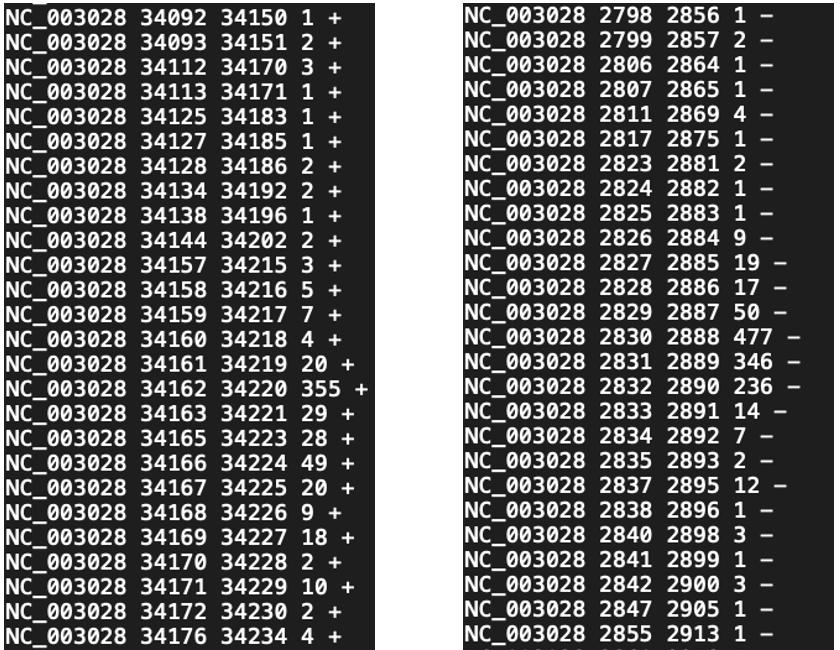
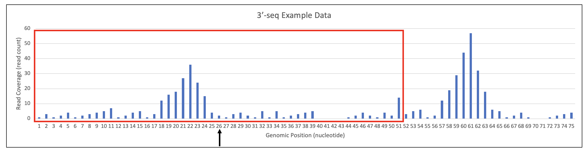
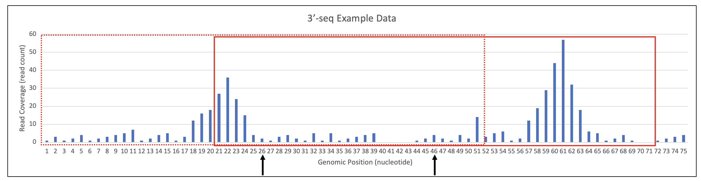
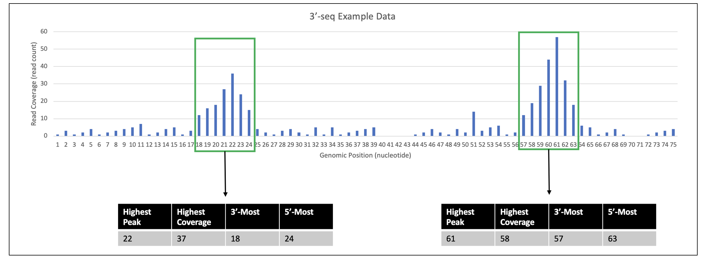

  

## Introduction

Bacteria rely on rapid alteration of transcription termination to regulate their
response to envrionmental perturbations. Premature termination of transcripts as
well as attenuation of transcript length (ex: only expressing some genes in an 
operon) are both prevalent signals and studying them has potent implications for
better understanding how antimicrobials affect bacteria. High throughput 
sequencing for studying termination signal (known as 3'-seq or term-seq) is 
currently available and more data sets are being created rapidly. However, 
unlike other high throughput sequencing methods, there is not standardized, 
easily accessible, statistically robust analysis tool. Here we present PIPETS 
(Poisson Identification of PEaks from Term-Seq data) which analyzes 3'-seq data
using a Poisson Distribution Test to identify termination signal that is 
statistically higher than the surrounding noise. These termination peaks can be
used to identify shifts in bacterial response and give a better understanding of
a very important set of targets for ongoing antimicrobial development.


## Quick Start

### Installation
To install PIPETS, use Bioconductor's BiocManager package.
```{r echo=TRUE, message=FALSE, eval=FALSE}
if (!require("BiocManager", quietly = TRUE))
    install.packages("BiocManager")

BiocManager::install("PIPETS")
```


### Basic PIPETS Run
PIPETS accepts two types of data as inputs: Bed Files or GRanges objects. Both
sets of data undergo the same analysis method. Running the method differs 
slightly if the user is using a GRanges input. Here we show the basic walkthrough 
of running PIPETS on an input Bed file. The five parameters that need to 
be specified to run PIPETS are `inputData`, the `readScore` of "good quality" reads,  
the prefix for the output file name `OutputFileID`, the file path to the output
director `OutputFileDir` ,and the type of input data `inputDataFormat`.

#### Bed File Input
```{r echo=TRUE, message=FALSE}

library(PIPETS)


#Bed File Input
PIPETS_FullRun(inputData = "PIPETS_TestData.bed"
               ,readScore = 42, OutputFileID = "ExampleResultsRun", 
               OutputFileDir = tempdir(),
               inputDataFormat = "bedFile")


```


#### GRanges Object Input
```{r echo=TRUE, message=FALSE}
library(PIPETS)
library(BiocGenerics)
library(GenomicRanges)
#GRanges object input
#When run on GRanges objects, PIPETS also outputs the strand split GRanges objects to a list for the user
#The first item in the list are the + strand reads, and the second are the - strand reads
GRanges_Object <- read.delim(file = "PIPETS_TestData.bed",
        header = FALSE, stringsAsFactors = FALSE)

GRanges_Object <- GRanges(seqnames = GRanges_Object$V1,
        ranges = IRanges(start = GRanges_Object$V2,end = GRanges_Object$V3
        ),score = GRanges_Object$V5 ,strand = GRanges_Object$V6)

ResultsList <- PIPETS_FullRun(inputData = GRanges_Object, readScore = 42, 
               OutputFileDir = tempdir(),
               OutputFileID = "ExampleResultsRun", inputDataFormat = "GRanges")

head(ResultsList)

```

### PIPETS Output
Per input Bed file, PIPETS will create 4 output files in the R directory. All
output files will begin with the user defined file name. 

First, PIPETS creates strand-split Bed files which it uses during analysis. 
PIPETS takes the input Bed file, separates the Plus-Strand (+) and the 
Complement-Strand (-) reads and counts how many reads are assigned to each 
genomic coordinate. 

```{r, echo=FALSE, out.width="100%", fig.align = 'center'}

```

For the results, PIPETS outputs a list of statistically significant termination
peaks for each strand. The output files contain information about the entire 
termination peak: the coordinate with the highest termination read coverage, the
termination read coverage at that position, as well as the coordinates spanning 
the full length of the termination peak. While the position of highest
termination read coverage is the most important result per peak, we also wanted
to recognize the shape of imperfect bacterial termination by including the full
range of each peak.


```{r, echo=FALSE, out.width="125%", fig.align = 'center'}
knitr::include_graphics("Sample_PIPETS_TotalOutput.png")
```


## Detailed Walkthrough
Term-seq/3'seq have allowed for the study of bacterial termination in a high
throughput manner. While there is a growing amount of studies using this data
to answer biological questions, there are still few robust analysis methods that
are widely available for use. Also, these methods do not analyze all termination
reads, focusing only on termination signal found inside of the 3'-UTR of genes.

PIPETS is the first term-seq/3'-seq analysis method that uses statistically 
robust analysis methods to differentiate significant termination signal from 
surrounding noise and provide termination results for all genomic contexts, not
just regions near genes. PIPETS is also the first term-seq/3'-seq analysis
method that is easily available on Bioconductor.

### Input Data Specifications

PIPETS takes in aligned term-seq/3'-seq reads in 
[Bed format](https://genome.ucsc.edu/FAQ/FAQformat.html#format1).
Traditional Bedformat files always has the same first 3 columns: chrom, 
chromStart, and chromStop. PIPETS requires that these three columns are in this
order to function. PIPETS also requires the score column and the strand column. 
PIPETS automtically detects which column contains the strand information, 
so the user does not need to specify its location.


PIPETS intentionally does not use gene information during its analysis. This is
to ensure that there is no gene-centric bias, and that all termination signal is
treated equally during significance testing. PIPETS' output files contain 
the genomic coordinates for all results, making downstream gene association
easy.

### Method Steps

PIPETS performs data analysis in three steps which takes raw Bed file 
term-seq/3'-seq reads and outputs a list of significant termination peaks for 
each strand. This section has a more detailed walkthrough of each step.

#### Step One: Poisson Test to Identify Significant Positions

The first step of PIPETS is to identify all genomic positions with termination
read coverage that is statistically significantly higher than that of the 
surrounding area. We employ a Poisson Distribution Test in a sliding window
framework to accomplish this. Using a Poisson Distribution Test allows for the 
assignment of statistical significance to our results. It also provides a way to
identify biologically significant signal that does not rely solely on global 
read coverage cutoffs. While PIPETS does use a global cutoff, it is designed to
capture very low read coverage values which are very likely to be biological or
technical noise. Using a sliding window framework allows for a more sensitive
identification system of significant read coverage levels. The sliding window
moves through the input data and tests small regions of the data, ensuring that
outlier read coverage values do not skew PIPETS ability to identify genomic
positions with read coverage that is significant in relation to its surrounding
region.

By default, PIPETS begins by creating the first sliding window at the 26th
position in the input data that spans 25bp upstream and downstream. It then 
performs a Poisson Distribution Test on each position in the window, comparing
its read coverage to the average read coverage of all positions in the window. 
If its coverage is significantly higher than expected from the average of the 
window, then it is identified as significant.

```{r, echo=FALSE, out.width="150%", fig.align = 'center'}

```

After all positions in the window have been tested, the window then moves 
downstream by 25 bp (by default) and tests again. This movement intentionally 
tests half of the positions a second time, increasing the potential for 
positions with read coverage that is overshadowed by nearby outliers to be
tested again, increasing the sensitivity of PIPETS.

```{r, echo=FALSE, out.width="150%", fig.align = 'center'}

```

After the final sliding window has been tested, PIPETS compiles all genomic 
positions that were identified at least once as being significant. We then employ
Benjamini-Hochberg multiple testing correction to reduce the incidence of Type I 
error. The resulting list of genomic positions with significant read coverage is
then passed to downstream steps. Many of these positions will be consecutive 
with at least one other position, which is expected as bacterial termination is 
not a perfectly succinct process, and there is often signal surrounding true 
termination positions. The next step of PIPETS processes these positions and 
addresses the data architecture of termination "peaks".

#### Step Two: Condensing of Proximal Significant Positions 

Step two of PIPETS begins with the list of all genomic positions with 
termination read coverage that is significantly higher than their surrounding
area. True termination signal in bacteria resembles peak like data
structures, with a position with the most coverage (likely the true terminator)
and positions on either side with termination read coverage that is higher than
the surrounding positions, but less than that of the highest point. All of the
positions inside of a peak likely have read coverages that are higher than the
surrounding area, and will be marked as significant. But they are not all
distinct termination signals, rather they are all part of the same termination
peak. Step two of PIPETS moves through the results set from step one and 
combines significant positions that are within 2bp of each other into single
termination peaks. The position with the highest read coverage is identified,
and the 3'-most and 5'-most coordinates are saved. This both reduces the total
number of results that need to be analyzed without discarding relevant data
about the results.

```{r, echo=FALSE, out.width="150%", fig.align = 'center'}

```


#### Step Three: Condensing of Proximal Significant Peaks

Step three of PIPETS is similar to step two, but instead of condensing 
consecutive significant positions, it condenses proximal significant peaks. This
is done for similar reasons as step two: we do not expect very proximal
termination peaks to be two distinct signals, rather they are likely the result
of loss of consistent signal due to technical problems. The default distance
for this step is 20bp, and during parameter testing there were no identified 
cases of this distance causing PIPETS to combine two independent signals. After
this step has completed running, PIPETS will output the strand specific results
files.

### Other Parameters
While PIPETS only requires 5 parameters from the user to run, there are 
other parameters that can be tuned to alter PIPETS' performance. These 
parameters have set defaults intended to provide a moderately strict analysis.

#### slidingWindowSize
slidingWindowSize (numerical value) defines the total size of the sliding window that is used in
the first step of PIPETS. The default is set to 25, which will create a sliding
window of size 51 (the first sliding window is created on the 26th genomic 
position by default, and extends 25 bp upstream and downstream of that 
postition).

#### slidingWindowMovementDistance
slidingWindowMovementDistance (numerical value) defines the distance that the sliding window moves
during the first step of PIPETS. By default it is set to 25. This ensures that
almost every position in the input data is tested twice, increasing the 
likelihood that PIPETS identifies biologically significant termination signal
that might otherwise be dwarfed by proximal positions with very high termination
read coverage. In testing, adjusting the slidingWindowMovementDistance to be
much smaller than the slidingWindowSize (which in turn would test most 
positions in the data more than two times) had diminishing returns on increasing
the sensitivity, and caused higher run times.

#### adjacentPeakDistance
adjacentPeakDistance (numerical value) is used in the second step of PIPETS to combine signal from
adjacent signficant termination positions. By default this is set to 2, meaning
that if two significant positions are within 2 bp of each other, they are added
to the same termination peak. In testing, raising this value had very little
impact, but by keeping above 1, we are ensuring that loss of signal due to 
technical problems does not create situations in which very proximal signal is
confused for separate termination results.

#### peakCondensingDistance
peakCondensingDistance (numerical value) is used in the third step of PIPETS to combine signal 
from proximal termination peaks. By default this is set to 20. It is used to
test if peaks are close enough together to be from the same termination signal,
or if they are sufficiently far away to be distinct termination sites.

#### threshAdjust
threshAdjust (numerical value greater than 0 and less than 1 as decimal) 
is used to establish a global cutoff for minimum read coverage for
the input data. By default it is set to 0.75. This parameter describes the 
percentage of the total read coverage that should be used to inform an "average"
read coverage cutoff. In other words, take the top 75% of the read coverage 
positions and assume that those positions encompass the biologically relevant
read coverage levels (and are likely too high to be the result of biological
or technical noise) that can be used to define an expected read coverage level
for biologically significant signal.

#### user_pValue
user_pValue (numerical value  less than 1 as decimal) is used in the first 
step of PIPETS and is the user defined p-value cutoff for the initial Poisson 
Distribution Test and the subsequent Benjamini-Hochberg multiple testing correction. 
By default it is set to 0.0005.

#### highOutlierTrim
highOutlierTrim (numerical value greater than 0 and less than 1 as decimal) 
is used to modulate the global read coverage minumum cutoff. By
default it is set to 0.01. This parameter is used to reduce the influence of 
very high read coverage positions in the creation of the global cutoff. The 
parameter describes what total percentage of the highest read coverage positions
should be excluded in the cutoff creation process. It removes the top 1% of 
positions (if there are 500 positions that contain the top 75% of all reads
then this parameter states to remove the top 5 of those top positions).

#### inputDataFormat
The default value is `bedFile` which assumes that the input will be a string
file path to the input bed file for the run. Alternatively, if the user has
created a GRanges object, the user can specify `GRanges` and enter the R 
GRanges object into the run method.


## Session Info

```{r sessionInfo}
sessionInfo()
```


